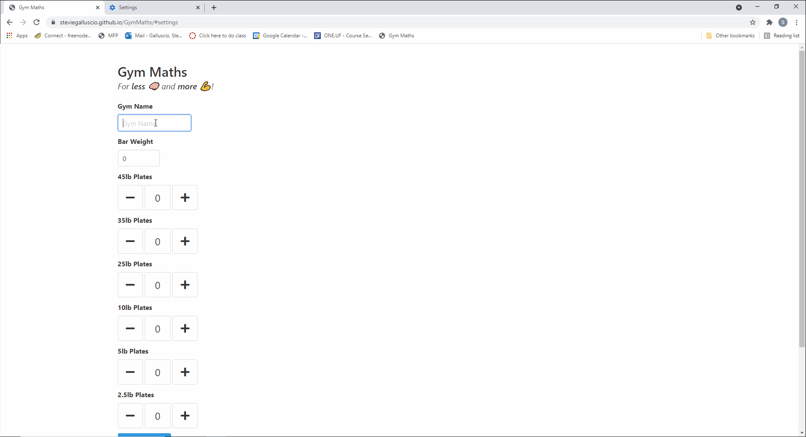

# Gym Maths :muscle:
A website useful in home gyms to calculate the plate combinations that add up to a desired weight on a barbell.
https://steviegalluscio.github.io/GymMaths/

<kbd> </kbd>

## Features
  * Given a required weight displays all combinations of plates that could be used.
  * If required weight is not possible, gives option for closest weight or weights.
  * Can bookmark or link to required weights (ex. https://steviegalluscio.github.io/GymMaths/#135)
  * Gym settings are saved in users web browser. 
  * Works on mobile devices.

## How to use
  1. Navigate to https://steviegalluscio.github.io/GymMaths/
  2. Enter gym name, barbell weight, and how many of each weight plate you have.
  3. Save settings.
  4. Enter a required weight.
  5. Receive all possible weight combinations.
  
## TODO
  * Implement option for Kilograms.
  * Allow user to add custom plates/ micro plates.
